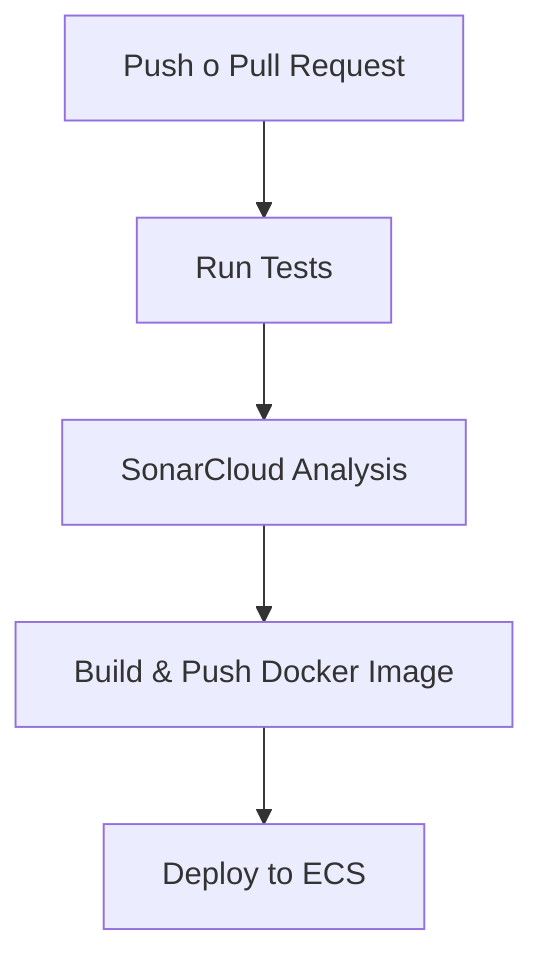

# 🚀 CI/CD para Backend Laravel con GitHub Actions + AWS ECS

Este repositorio implementa una solución completa de CI/CD (Integración y Despliegue Continuo) utilizando **GitHub Actions**, **Docker**, **Amazon ECR/ECS** y **SonarCloud** para una aplicación Laravel.

---

## 📦 Características principales

- Validación automática de código mediante **tests unitarios**.
- Propongo utilizar "SonarCloud" para el análisis de calidad de código con **SonarCloud**.
- Construcción de imágenes Docker optimizadas.
- Push automático a **Amazon ECR**.
- Despliegue continuo sobre **Amazon ECS (Fargate)**.
- Compatible con ramas `main` y `staging`.

---

## 🧰 Requisitos previos

### 📁 Estructura esperada del proyecto

El repositorio debe contener:

- Un proyecto Laravel funcional (`composer.json`, `artisan`, `/tests`)
- Un `Dockerfile` válido para construir la app
- Un archivo `.env.example` con las variables necesarias

### 🔐 GitHub Secrets requeridos

Estos secretos se deben reemplazar con las KEY pertenecientes a AWS rFlex.io:

| Clave | Descripción |
|------|-------------|
| `AWS_ACCESS_KEY_ID` | Access Key de tu IAM user |
| `AWS_SECRET_ACCESS_KEY` | Secret Key del IAM user |
| `SONAR_TOKEN` | Token de proyecto SonarCloud para análisis de código |

---

## ⚙️ Pipeline CI/CD paso a paso

### 1. `test` – Validación del código

Se ejecuta en `pull_request` y `push` sobre `main` o `staging`.

**Acciones realizadas:**
- Instalación de dependencias con Composer.
- Copia de variables `.env.example` → `.env`.
- Generación de clave con `php artisan key:generate`.
- Ejecución de pruebas con `php artisan test`.

✅ **Objetivo:** Asegurar que el código nuevo no rompa la funcionalidad existente.

---

### 2. `sonarcloud-check` – Análisis de calidad

Se ejecuta solo si los tests pasan exitosamente.

**Acciones realizadas:**
- Análisis de código estático usando SonarCloud.

✅ **Objetivo:** Detectar código duplicado, deuda técnica, vulnerabilidades y problemas de estilo.

---

### 3. `build-and-push` – Construcción de la imagen Docker

Se ejecuta si pasa el análisis de SonarCloud.

**Acciones realizadas:**
- Login a Amazon ECR.
- Construcción de la imagen Docker con tag `github.sha`.
- Push de la imagen al repositorio ECR definido (`rfex-backend`).

✅ **Objetivo:** Asegurar una imagen reproducible y versionada para deploy.

---

### 4. `deploy` – Despliegue en AWS ECS

Se ejecuta al finalizar correctamente el build de Docker.

**Acciones realizadas:**
- Llamada a `aws ecs update-service` con `--force-new-deployment` para reiniciar el contenedor con la nueva imagen.

✅ **Objetivo:** Desplegar automáticamente en ECS (Fargate o EC2) sin tiempos muertos.

---

## 🔁 Flujo general

---

### `Conclusión`
Este proceso está pensado para que una vez se tengan las key necesarias se peuda desplegar para dar continuidad a los problemas vistos y que el codigo pase por un proceso de validación y no se realice de manera manual, ya que el problema más grande que noté es la falta de un ambiente QA antes de pasar a producción. Teniendo las keys de AWS y las herramientas propuestas calzan perfecto para tener un sistema robusto.